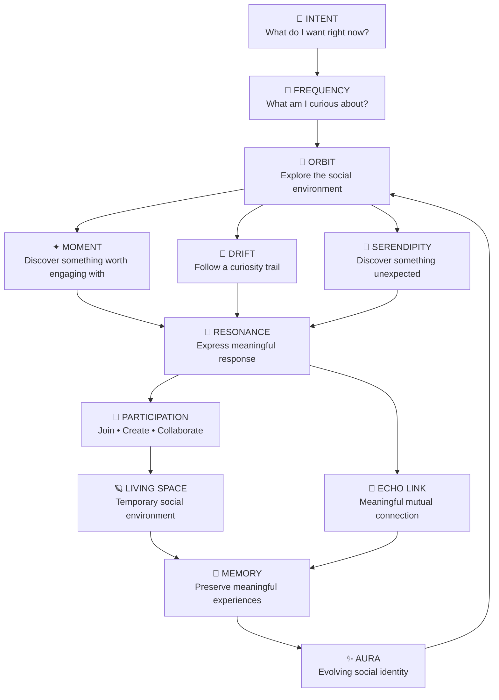
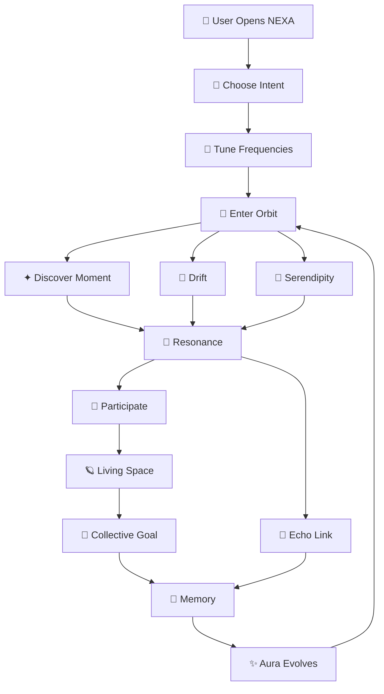
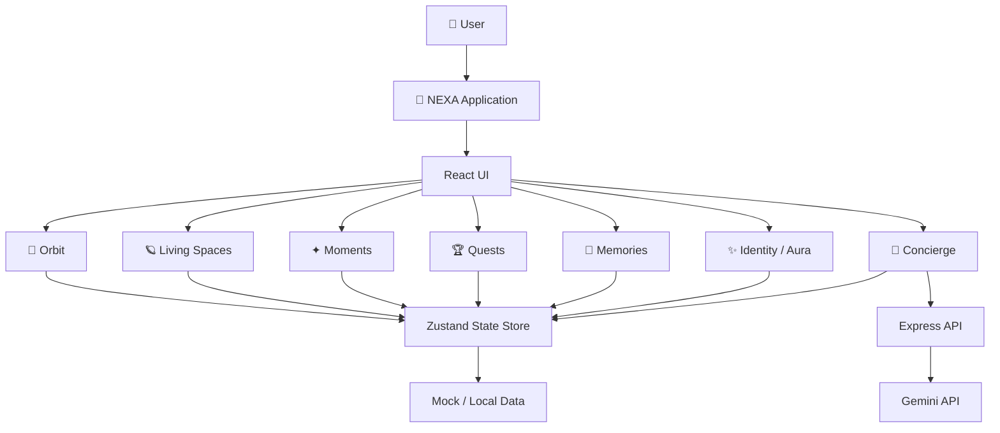
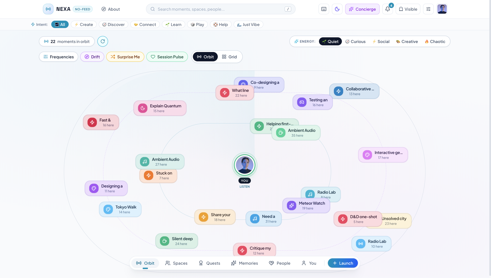
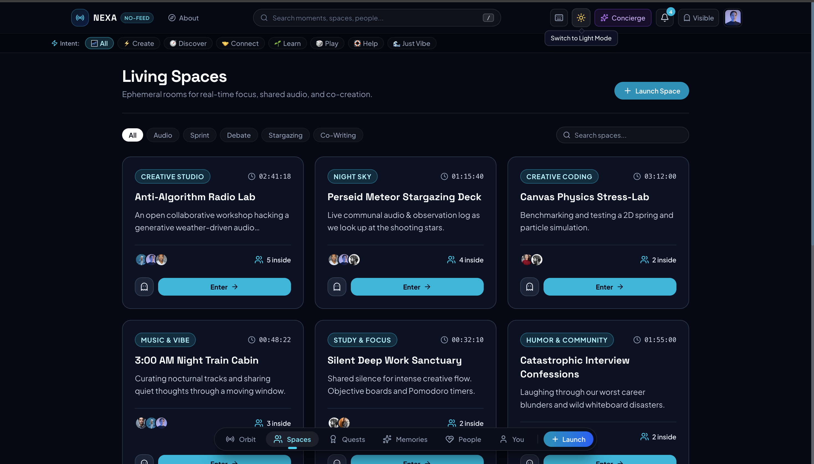
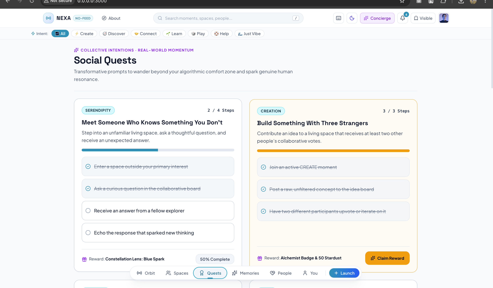
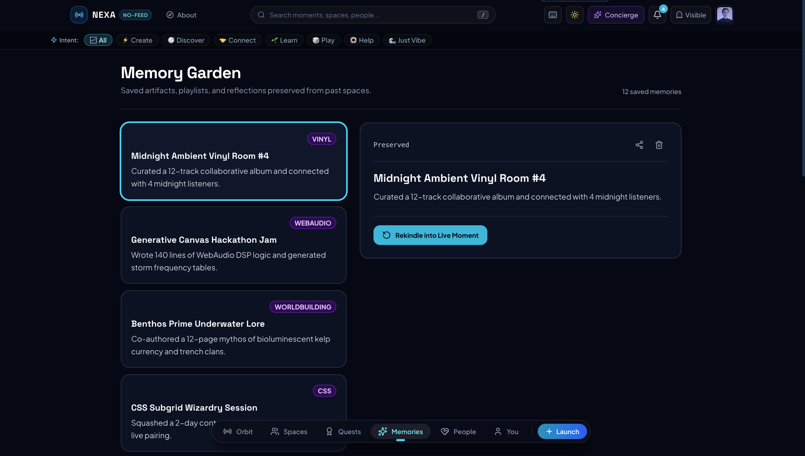
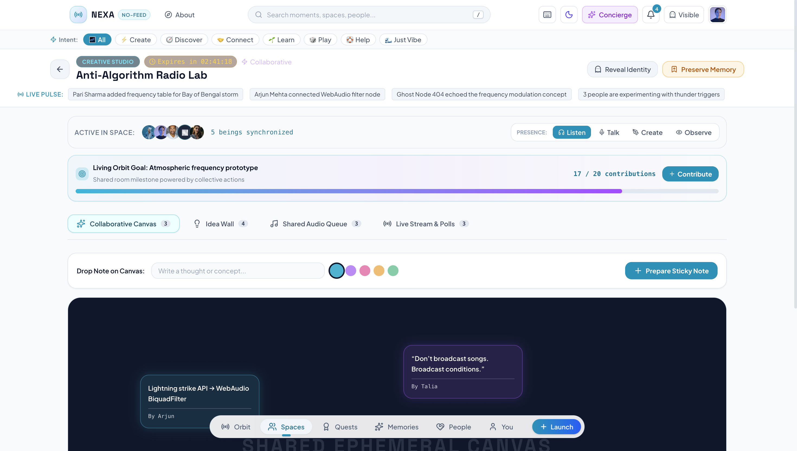

# 🌌 NEXA

## Social Without the Feed.

> **Don't follow people. Follow moments.**

<p align="center">
  <strong>
    NEXA is an experimental social experience built around intent, curiosity,
    resonance, participation and meaningful connection — not infinite scrolling.
  </strong>
</p>

<p align="center">
  <a href="https://nexa-social-arena.vercel.app/">🌐 Live Demo</a>
  &nbsp; • &nbsp;
  <a href="https://github.com/23-shivamsingh/NEXA">💻 Source Code</a>
</p>

---

# 🏆 Hackathon

## The Frontend Odyssey 2026 — Frontend Arena

NEXA was created for the:

> **REIMAGINE SOCIAL — Design the Next Generation of Social Interaction**

The challenge asks us to rethink what social interaction could look like beyond the familiar patterns of:

- Infinite feeds
- Likes
- Followers
- Popularity metrics
- Algorithm-driven discovery
- Passive content consumption

NEXA explores a different model:

```text
Intent
   ↓
Curiosity
   ↓
Exploration
   ↓
Resonance
   ↓
Participation
   ↓
Connection
   ↓
Memory
```

Instead of asking:

> **"What should I scroll next?"**

NEXA asks:

> **"What do I want to experience right now?"**

---

# 🚨 The Problem

Most social platforms still rely on a familiar interaction loop:

```text
Open App
   ↓
Infinite Feed
   ↓
Scroll
   ↓
Like
   ↓
Follow
   ↓
Scroll Again
   ↓
Repeat
```

This model is effective at continuously delivering content, but it can turn social interaction into passive consumption.

Common problems include:

- Infinite scrolling
- Popularity-driven discovery
- Follower pressure
- Engagement competition
- Algorithmic filter bubbles
- Social comparison
- Passive content consumption
- Pressure to constantly perform an online identity
- Communities that remain active after their original purpose disappears

The fundamental question becomes:

> **"How long can we keep the user here?"**

NEXA proposes a different question:

> **"What meaningful experience can the user have here?"**

---

# 💡 Our Solution — NEXA

NEXA replaces the traditional feed-centric social model with an environment built around **intentional participation**.

Instead of immediately receiving an endless content stream, users can:

```text
Choose Intent
      ↓
Tune Frequencies
      ↓
Explore Orbit
      ↓
Discover Moments
      ↓
Resonate
      ↓
Participate
      ↓
Connect
      ↓
Create Memories
```

The user becomes an active participant rather than simply a consumer of an algorithmically ordered timeline.

NEXA is not just a visual redesign of a social network.

It changes the underlying interaction model.

---

# 🧠 The Core Idea

Traditional social platforms often look conceptually like:

```text
People
   ↓
Followers
   ↓
Posts
   ↓
Likes
   ↓
Algorithm
   ↓
Feed
   ↓
Scroll
```

NEXA experiments with:

```text
Intent
   ↓
Frequencies
   ↓
Orbit
   ↓
Moments
   ↓
Resonance
   ↓
Participation
   ↓
Connection
   ↓
Memory
```

The important difference is that **the user's current intention becomes the starting signal**.

The platform is no longer only deciding what to show.

The user first communicates what kind of experience they want.

---

# 🔄 Reimagining Social Primitives

| Traditional Social | NEXA |
|---|---|
| 📜 Infinite Feed | 🌌 Orbit |
| 📝 Post | ✦ Moment |
| ❤️ Like | 💫 Resonance |
| 👥 Follow | 📡 Frequency |
| 👤 Followers | 🔗 Echo Links |
| 👥 Groups | 🪐 Living Spaces |
| 📜 Infinite Scroll | 🧭 Drift |
| 🧑 Profile Grid | ✨ Aura |
| 🔥 Trending | 🎲 Serendipity |
| 📊 Popularity | 🤝 Participation |
| 📦 Archive | 🌿 Memory Garden |

These are not isolated feature replacements.

Together, they form NEXA's alternative social interaction model.

---

# 🌌 Product Flow



---

# ✨ Key Features

## 01 — 🌌 Orbit

### The Feed → Orbit

Orbit is the primary discovery environment of NEXA.

Instead of presenting Moments as a vertically stacked timeline, NEXA places them into a spatial environment around the user.

```text
                    ✦ Moment

        ✦ Moment               ✦ Moment


                       YOU


        ✦ Moment               ✦ Moment

                    ✦ Moment
```

Orbit can respond to:

- Current Intent
- Frequencies
- Active Moments
- Social Energy
- Discovery state
- User interaction

The purpose is not simply to make a feed look different.

The purpose is to change the user's mental model from:

> **"What should I scroll next?"**

to:

> **"Where do I want to explore?"**

---

## 02 — 🎯 Intent

NEXA starts with the user's current intention.

Available intent categories include:

```text
⚡ Create
🧭 Discover
🤝 Connect
🌱 Learn
🎲 Play
🛟 Help
🌊 Just Vibe
```

Instead of making the algorithm the first decision-maker, NEXA lets the user provide an initial signal.

```text
"What do I want right now?"
             ↓
           Intent
             ↓
      Discovery Context
```

Intent is temporary and contextual.

It represents what the user wants from the social experience **right now**, rather than defining their permanent identity.

---

## 03 — 📡 Frequencies

### Following People → Following Curiosity

NEXA experiments with replacing follower-centric discovery with **Frequencies**.

A Frequency represents an area of curiosity or interest.

Examples:

```text
#GenerativeAudio
#SpatialComputing
#LateNightPhilosophy
#StreetPhotography
#OpenWebProtocols
#AmbientSynthesis
```

Instead of asking:

> "Who should I follow?"

NEXA asks:

> "What am I curious about?"

The selected Frequencies can influence what appears inside Orbit.

```text
Frequency
    ↓
Orbit Context
    ↓
New Moments
    ↓
New People
    ↓
New Spaces
```

---

## 04 — ✦ Moments

### Posts → Moments

A Moment is NEXA's alternative to a conventional social-media post.

A Moment is designed as a **social invitation** rather than just a piece of content.

Examples:

```text
"Need someone to critique this idea."

"Anyone up for a late-night music recommendation?"

"Let's solve this problem together."

"Looking for people interested in generative audio."

"Help me turn this rough idea into something real."
```

The goal is to encourage:

```text
Moment
   ↓
Resonance
   ↓
Participation
   ↓
Connection
```

A Moment can represent an idea, question, activity, request, challenge or opportunity for collaboration.

---

## 05 — 💫 Resonance

### Likes → Resonance

NEXA replaces the conventional public Like with **Resonance**.

Traditional platforms might emphasize:

```text
❤️ 2,481 Likes
```

NEXA focuses more on the user's interaction with a Moment.

Resonance can involve interaction patterns such as:

- Press and hold
- Radial progress
- Ripple effects
- Pulse animations
- Tactile visual feedback
- Progressive interaction

The design goal is:

> **Meaningful response instead of public popularity competition.**

Resonance can also contribute to subsequent social experiences such as connections, memories and identity signals.

---

## 06 — 🔗 Echo Links

### Followers → Echo Links

NEXA does not require relationships to begin with a one-sided follower action.

An **Echo Link** represents a meaningful connection that can emerge through interaction.

```text
Discover
    ↓
Shared Moment
    ↓
Resonance
    ↓
Repeated Interaction
    ↓
Echo Link
```

The concept is:

> **"We keep finding something meaningful in each other's presence."**

This makes connection an outcome of interaction rather than a number displayed on a profile.

---

## 07 — 🧭 Drift

### Infinite Scroll → Curiosity Trail

Drift provides an alternative mental model to infinite scrolling.

Traditional discovery:

```text
Scroll
 ↓
Scroll
 ↓
Scroll
 ↓
Scroll
 ↓
...
```

NEXA Drift:

```text
Moment
   ↓
Unexpected idea
   ↓
Another Moment
   ↓
Person
   ↓
Living Space
   ↓
New curiosity
```

Drift turns discovery into a journey.

The user follows curiosity instead of endlessly consuming a predetermined queue.

---

## 08 — 🎲 Serendipity

### Trending → Unexpected Discovery

Most social platforms optimize discovery around relevance, popularity or previous engagement.

NEXA also explores the value of **unexpected discovery**.

Serendipity provides an intentional escape from the user's normal discovery pattern.

```text
Normal Orbit
     ↓
Serendipity
     ↓
Unexpected Moment
     ↓
New Interest
     ↓
Potential Connection
```

The goal is to introduce controlled randomness and curiosity without turning discovery into another popularity ranking.

---

## 09 — 🪐 Living Spaces

### Groups → Living Spaces

NEXA Spaces are designed as temporary social environments.

A Space can revolve around:

- A project
- A conversation
- Music
- Learning
- Creativity
- A challenge
- A shared activity

Examples:

```text
🎧 Anti-Algorithm Radio Lab

🌌 Midnight Stargazing Deck

🧪 Physics Stress-Lab

🎵 3:00 AM Night Train

🎨 Creative Prototype Room
```

The philosophy is:

> **Don't just join a group. Enter an experience.**

---

## 10 — 🎯 Collective Goals

Living Spaces can contain shared objectives.

Examples:

```text
COLLABORATIVE PLAYLIST

████████████████░░░░

17 / 20 contributions
```

Other examples:

```text
Build a concept
3 / 5 contributors

Solve the puzzle
7 / 10 clues

Create a playlist
17 / 20 tracks
```

This changes the focus from:

```text
"How many likes did this get?"
```

to:

```text
"What did we create together?"
```

---

## 11 — 🫱 Presence

NEXA supports lower-pressure participation.

Inside a Space, users can communicate their current mode:

```text
💬 Talk
👂 Listen
🎨 Create
👁 Observe
```

This allows someone to participate without being required to constantly post or comment.

The message becomes:

> **"I'm here."**

rather than:

> **"I need to perform."**

---

## 12 — 🌿 Memory Garden

Meaningful experiences should not necessarily disappear into an endless timeline.

NEXA introduces **Memories** as a way of preserving selected experiences.

A Memory can represent:

- A Moment
- A collaboration
- A Space
- A creative artifact
- A meaningful interaction
- A completed Quest

```text
Live Experience
       ↓
Meaningful Interaction
       ↓
Memory
       ↓
Memory Garden
       ↓
Rekindle
       ↓
New Experience
```

Memory is treated as part of the social journey rather than simply an archive of old posts.

---

## 13 — ✨ Aura

### Profile Grid → Living Identity

Instead of representing identity primarily through a static profile grid, NEXA introduces **Aura**.

Aura represents an evolving identity built from participation.

Example dimensions:

```text
✦ Creator
🧭 Explorer
🔗 Connector
⚡ Builder
```

Conceptually:

```text
Exploration
    +
Creation
    +
Resonance
    +
Connection
    +
Participation
        ↓
      AURA
```

The philosophy is:

> **Identity is something you develop through experiences, not something you display through follower counts.**

---

## 14 — 🤖 Social Concierge

The Concierge acts as an intelligent social navigator.

Instead of functioning only as a traditional chatbot, the Concierge can help users navigate the NEXA ecosystem.

Example requests:

```text
"What can I do right now?"

"I want to meet creative people."

"I'm bored but don't want to scroll."

"I want to build something with someone."

"Show me something completely unexpected."
```

The intended navigation model is:

```text
Intent
  ↓
Frequencies
  ↓
Moments
  ↓
Spaces
  ↓
People
```

NEXA also includes contextual fallback behavior so the prototype can still demonstrate the social-navigation experience when external AI access is unavailable.

---

## 15 — 🏆 Social Quests

Quests turn discovery into active participation.

Examples:

```text
Meet someone who knows something you don't.

Explore a Space outside your usual interests.

Ask a thoughtful question.

Create something with someone new.

Discover a new Frequency.

Remix an existing Moment.
```

The objective is to turn social discovery into an activity rather than passive consumption.

---

## 16 — 🔀 Remix

NEXA treats ideas as things that can evolve.

A Moment can transform through participation:

```text
Thought
  ↓
Question
  ↓
Challenge
  ↓
Collaboration
  ↓
Artifact
```

Remix allows users to build on an existing idea instead of simply reacting to it.

This supports the larger NEXA philosophy of:

> **Participation over consumption.**

---

## 17 — 👻 Ghost Mode

Ghost Mode provides a lower-pressure exploration experience.

The idea is to allow users to explore selected parts of NEXA without turning every action into a permanent social signal.

This supports:

- Exploration
- Experimentation
- Curiosity
- Low-pressure participation

Ghost Mode reinforces the idea that not every social action needs to become a public performance.

---

## 18 — 🧠 Moment Lifecycle

NEXA treats Moments as potentially living experiences rather than permanent posts.

```text
Moment Created
      ↓
Discovery
      ↓
Resonance
      ↓
Participation
      ↓
Meaningful Interaction
      ↓
┌───────────────┐
│               │
▼               ▼
Fades         Anchors
│               │
▼               ▼
Expires       Memory
                │
                ▼
          Memory Garden
```

A Moment can gain lasting relevance through meaningful interaction rather than raw popularity.

---

## 19 — ⚡ Social Energy

Users can communicate their current social state.

Examples:

```text
🌙 Quiet
🧭 Curious
🤝 Social
🎨 Creative
⚡ Chaotic
```

Social Energy is not intended to be a permanent personality label.

It represents:

> **"What kind of social experience do I want right now?"**

This can provide additional context for discovery and interaction.

---

# 🔗 How the Features Connect

NEXA is designed as a connected social system rather than a collection of unrelated screens.

The primary relationship is:

```text
Intent
   ↓
Frequency
   ↓
Orbit
   ↓
Moment
   ↓
Resonance
   ↓
Participation
   ↓
Echo Link
   ↓
Memory
   ↓
Aura
   ↓
Orbit
```

Other discovery paths include:

```text
Orbit
  ↓
Drift
  ↓
New Moment
  ↓
Resonance
```

```text
Orbit
  ↓
Serendipity
  ↓
Unexpected Moment
  ↓
New Interest
```

```text
Orbit
  ↓
Living Space
  ↓
Collective Goal
  ↓
Collaboration
  ↓
Memory
```

```text
Concierge
  ↓
Intent
  ↓
Frequency
  ↓
Moment / Space / Person
```

This interconnected model is what allows NEXA to behave like a social environment rather than simply another collection of feeds and profiles.

---

# 🔄 Complete User Journey



---

# 🧩 Why NEXA Is Different

NEXA is intentionally not designed as:

```text
Another Instagram
Another Reddit
Another X
Another TikTok
Another Snapchat
```

The objective is not to create another platform with a different visual skin.

The objective is to rethink the fundamental primitives of social interaction.

```text
Feed
 ↓
Orbit

Post
 ↓
Moment

Like
 ↓
Resonance

Follow
 ↓
Frequency

Follower
 ↓
Echo Link

Group
 ↓
Living Space

Scroll
 ↓
Drift

Profile
 ↓
Aura

Trending
 ↓
Serendipity

Archive
 ↓
Memory
```

The difference is not only visual.

> **NEXA changes what the user is actually doing.**

---

# 🏗️ System Architecture



---

# 🧩 Frontend Architecture

The frontend is organized around feature-oriented React components.

```text
src/
│
├── components/
│   │
│   ├── common/
│   ├── orbit/
│   ├── spaces/
│   ├── discover/
│   ├── memories/
│   ├── quests/
│   ├── identity/
│   ├── matches/
│   ├── concierge/
│   ├── notifications/
│   └── modals/
│
├── data/
│   └── mockData.ts
│
├── store/
│   └── useNexaStore.ts
│
├── types/
│   └── index.ts
│
├── App.tsx
├── index.css
└── main.tsx
```

The structure separates major product areas while keeping shared interaction and state logic reusable.

---

# 🛠️ Technology Stack

| Layer | Technology |
|---|---|
| Frontend | React |
| Language | TypeScript |
| Build Tool | Vite |
| Styling | Tailwind CSS |
| State Management | Zustand |
| Animation / Motion | Motion |
| Icons | Lucide React |
| Visual Effects | SVG / CSS |
| Backend | Express.js |
| Runtime | Node.js |
| AI Integration | Google GenAI SDK |
| Data | Mock / Local Data |
| Version Control | Git + GitHub |
| Deployment | Vercel |

---

# 🤖 AI Architecture

NEXA includes an optional AI-powered Concierge.

The architecture follows a server-side API boundary:

```text
Frontend
   ↓
/api/concierge
   ↓
Express Server
   ↓
Google GenAI SDK
   ↓
Gemini
```

The API key is kept on the server side rather than exposed directly in the browser.

NEXA also maintains contextual fallback behavior so that the prototype can still demonstrate its social-navigation experience when external AI access is unavailable.

---

# ⚡ Performance

Performance is particularly important for a spatial interface like NEXA because Orbit contains multiple animated and interactive elements.

The project follows these principles:

- Avoid unnecessary component re-renders
- Keep transient interaction state isolated where practical
- Prefer transform-based visual updates
- Clean up timers and event listeners
- Keep state subscriptions focused
- Avoid unnecessary calculations during rendering
- Reuse components instead of duplicating UI logic
- Keep animation and interaction work localized
- Preserve responsive performance on smaller screens

The Orbit experience is the primary performance-sensitive area because it combines:

- Spatial positioning
- Animated nodes
- Pointer interaction
- Touch interaction
- Filters
- Discovery controls
- Moment inspection
- Multiple visual states

Performance improvements should preserve the existing visual behavior rather than simplifying the experience.

---

# 🧹 Code Quality

NEXA uses TypeScript throughout the application and is structured around reusable React components and centralized application state.

The codebase focuses on:

- Typed component props
- Shared domain types
- Reusable UI components
- Centralized Zustand state
- Feature-oriented component organization
- Effect cleanup
- Typed API boundaries
- Separation of UI and state logic
- Maintainable interaction handlers
- Avoiding unnecessary duplication
- Clear component responsibilities

The goal is to keep the prototype understandable while providing a foundation that can evolve into a larger application.

---

# 🎨 Design System

NEXA uses a spatial visual language designed to communicate the idea of a social environment rather than a traditional content feed.

## Visual Principles

- 🌌 Spatial / orbital layouts
- ✨ Soft gradients
- 🔵 Cyan interaction signals
- 🟣 Violet discovery states
- 🌙 Dark and light themes
- Thin borders
- Rounded surfaces
- Strong visual hierarchy
- Contextual animation
- Tactile interaction feedback

## Design Goal

NEXA should feel:

> **Futuristic. Calm. Spatial. Tactile. Human.**

The visual system exists to reinforce the product concept rather than simply decorate the interface.

---

# 🎞️ Motion & Interaction

Motion in NEXA is primarily used to communicate state and interaction.

Examples:

```text
Intent Change
     ↓
Orbit Recalibration
```

```text
Moment Interaction
     ↓
Resonance Feedback
```

```text
Echo Link
     ↓
Connection Animation
```

```text
Quest Completion
     ↓
Progress Feedback
```

```text
Memory Rekindle
     ↓
Experience Transition
```

Interactive states generally communicate:

```text
IDLE
  ↓
HOVER
  ↓
ACTIVE
  ↓
SELECTED
```

Touch interactions are supported separately from hover-based interactions so that the experience remains usable on mobile devices.

---

# 📱 Responsive Design

NEXA is designed as a responsive experience across:

```text
Desktop
   ↓
Tablet
   ↓
Mobile
```

## Desktop

- Spatial Orbit
- Full navigation
- Expanded layouts
- Larger interaction surfaces
- Rich contextual panels
- Multi-column experiences

## Tablet

- Responsive grids
- Reduced density
- Touch-friendly controls
- Contextual panels
- Flexible spacing

## Mobile

- Mobile navigation
- Bottom navigation
- Touch interactions
- Mobile drawers
- Mobile sheets
- Simplified Orbit density
- Responsive cards
- Single-column layouts

The goal is not to simply shrink the desktop UI.

The interaction model adapts to the available screen and input method.

---

# 🌓 Theme Support

NEXA supports:

```text
☀️ Light Mode
🌙 Dark Mode
```

The design system aims to maintain:

- Readable text
- Distinguishable surfaces
- Visible controls
- Clear borders
- Consistent interaction states
- Usable navigation

---

# ♿ Accessibility

Accessibility is considered throughout the interface.

NEXA includes support for:

- Semantic interactive elements
- Keyboard navigation
- Visible focus states
- Accessible controls
- Appropriate labels
- Responsive dialogs
- Escape-to-close interactions
- Reduced-motion considerations
- Touch-friendly interaction
- Mobile usability

New interactive functionality should follow the same principles.

The goal is to ensure that NEXA's spatial interaction model does not come at the expense of usability.

---

# 🧠 State & Data Model

NEXA uses Zustand for centralized application state.

Conceptually, the application state connects:

```text
                    NEXA STATE

                        │

        ┌───────────────┼────────────────┐
        │               │                │
        ▼               ▼                ▼
      USER          DISCOVERY          SOCIAL
        │               │                │
        │          ┌────┼────┐       ┌───┴────┐
        │          ▼    ▼    ▼       ▼        ▼
        │       Intent Freq Orbit Resonance Echo
        │
        ├───────────────┐
        ▼               ▼
      AURA           MEMORY
        │               │
        └───────┬───────┘
                ▼
              ORBIT
```

This allows interactions in one part of the product to influence other experiences.

For example:

```text
Resonance
    ↓
Connection
    ↓
Memory
    ↓
Aura
```

---

# 📁 Project Structure

```text
NEXA/
│
├── public/
│   └── favicon.svg
│
├── docs/
│   └── screenshots/
│       ├── orbit.png
│       ├── spaces.png
│       ├── quests.png
│       ├── memories.png
│       └── concierge.png
│
├── src/
│   ├── components/
│   │   ├── common/
│   │   ├── concierge/
│   │   ├── discover/
│   │   ├── identity/
│   │   ├── landing/
│   │   ├── matches/
│   │   ├── memories/
│   │   ├── modals/
│   │   ├── notifications/
│   │   ├── orbit/
│   │   ├── quests/
│   │   └── spaces/
│   │
│   ├── data/
│   │   └── mockData.ts
│   │
│   ├── store/
│   │   └── useNexaStore.ts
│   │
│   ├── types/
│   │   └── index.ts
│   │
│   ├── App.tsx
│   ├── index.css
│   └── main.tsx
│
├── index.html
├── package.json
├── package-lock.json
├── server.ts
├── tsconfig.json
├── vite.config.ts
├── metadata.json
└── README.md
```

---

# 🚀 Getting Started

## Prerequisites

Make sure you have:

- Node.js 18+
- npm
- Git

---

## 1. Clone the Repository

```bash
git clone https://github.com/23-shivamsingh/NEXA.git
cd NEXA
```

---

## 2. Install Dependencies

```bash
npm install
```

---

## 3. Configure Environment Variables

Create a local environment file if you want to enable the Gemini-powered Concierge.

```bash
touch .env
```

Add:

```env
GEMINI_API_KEY=your_gemini_api_key
```

Never commit real API keys or secrets to GitHub.

Recommended `.gitignore` entries:

```gitignore
node_modules/
dist/
.env
.env.local
.env.*.local
```

---

## 4. Start Development Server

```bash
npm run dev
```

The project runs through the Express + Vite development server.

Open the local URL shown in your terminal.

---

# 🏗️ Production Build

Create a production build with:

```bash
npm run build
```

Start the production server with:

```bash
npm start
```

---

# 🧪 TypeScript / Code Validation

Run TypeScript validation with:

```bash
npm run lint
```

This checks the project for TypeScript errors without generating output files.

---

# 📸 Screenshots

## 🌌 Orbit

<p align="center">
  
</p>

> The traditional feed becomes a spatial Orbit where Moments appear as discoverable social nodes.

---

## 🪐 Living Spaces

<p align="center">
  
</p>

> Temporary social environments built around collaboration, creativity, learning and shared experiences.

---

## 🏆 Social Quests

<p align="center">
  
</p>

> Quests turn passive discovery into active social participation.

---

## 🌿 Memory Garden

<p align="center">
  
</p>

> Meaningful Moments and interactions can become Memories instead of disappearing into an endless timeline.

---

## 🤖 Social Concierge

<p align="center">
  
</p>

> Concierge helps users navigate Moments, Spaces, Frequencies and social experiences.

---

# 🎤 Judge Demo Flow

A short demo can communicate the NEXA concept quickly.

## Step 1 — Open NEXA

Start at the NEXA Orbit.

Show:

```text
NO-FEED
```

Explain:

> "NEXA isn't another infinite-scroll social platform. The starting point is an interactive social environment."

---

## Step 2 — Choose Intent

Select an intent such as:

```text
🧭 Discover
```

Explain:

> "Instead of starting with a feed, NEXA starts by asking what I want right now."

---

## Step 3 — Tune a Frequency

Select a curiosity or Frequency.

For example:

```text
#SpatialComputing
```

Show the Orbit responding to the selected context.

---

## Step 4 — Open a Moment

Select a Moment.

Explain:

> "A Moment isn't just content. It's an invitation to participate."

---

## Step 5 — Demonstrate Resonance

Use the Resonance interaction.

Explain:

> "Instead of a public Like count, NEXA uses Resonance as a more expressive response."

---

## Step 6 — Enter a Living Space

Open a Space.

Show:

- Participants
- Presence
- Collective Goal
- Collaboration

Explain:

> "Instead of joining a permanent group, you enter a temporary social environment built around an experience."

---

## Step 7 — Explore Connection

Show the Echo Link / connection experience.

Explain:

> "Connection is presented as something that can emerge from meaningful interaction."

---

## Step 8 — Show Memories

Open the Memory experience.

Explain:

> "Meaningful experiences don't have to disappear into an infinite feed."

---

## Step 9 — Show Aura

Open:

```text
You → Aura
```

Explain:

> "Instead of a static profile grid, NEXA represents identity as something that evolves through experiences."

---

## Step 10 — Use Concierge

Open Concierge and ask:

```text
"What can I do right now?"
```

or:

```text
"Show me something unexpected."
```

Explain:

> "Concierge acts as a social navigator rather than simply a chatbot."

---

# 🎯 Evaluation Alignment

NEXA is designed around the core requirements of the Reimagine Social challenge.

## Problem Alignment

NEXA directly challenges:

- Infinite feeds
- Passive consumption
- Popularity-driven discovery
- Follower-centric relationships
- Algorithm-first discovery

The alternative is:

```text
Intent
   ↓
Exploration
   ↓
Participation
   ↓
Connection
```

---

## UI / UX

The interface uses:

- Spatial discovery
- Orbiting Moments
- Intent controls
- Contextual panels
- Responsive navigation
- Light and dark themes
- Purposeful motion
- Tactile interaction states

The visual language is designed around the NEXA concept instead of copying an existing social platform.

---

## Functionality

The prototype connects multiple experiences:

- Orbit discovery
- Grid discovery
- Intent selection
- Frequency selection
- Moment exploration
- Resonance interaction
- Echo Links
- Drift
- Serendipity
- Living Spaces
- Collective Goals
- Presence
- Social Quests
- Memories
- Aura
- People discovery
- Concierge
- Remix
- Notifications
- Search
- Ghost Mode
- Theme switching
- Responsive navigation

---

## Innovation

NEXA introduces a new social vocabulary:

```text
Feed       → Orbit
Post       → Moment
Like       → Resonance
Follow     → Frequency
Follower   → Echo Link
Group      → Living Space
Scroll     → Drift
Trending   → Serendipity
Profile    → Aura
Archive    → Memory
```

The innovation is not any single feature.

It is the attempt to connect these primitives into one coherent social model.

---

# 📊 Traditional Social vs NEXA

## Traditional Social

```text
POST
  ↓
LIKE
  ↓
FOLLOW
  ↓
ALGORITHM
  ↓
FEED
  ↓
SCROLL
  ↓
REPEAT
```

## NEXA

```text
INTENT
  ↓
CURIOSITY
  ↓
EXPLORE
  ↓
RESONATE
  ↓
PARTICIPATE
  ↓
CONNECT
  ↓
CREATE
  ↓
REMEMBER
```

The difference is fundamentally about the user's role.

```text
Traditional:

User → Consumer


NEXA:

User → Explorer → Participant → Contributor
```

---

# 🧭 Design Principles

## 01 — Intent Over Algorithm

The user provides the first signal.

## 02 — Participation Over Consumption

Social experiences should lead somewhere.

## 03 — Resonance Over Popularity

Meaning matters more than public numbers.

## 04 — Curiosity Over Filter Bubbles

Discovery should sometimes surprise us.

## 05 — Experience Over Profile

People are more than their profile grids.

## 06 — Connection Over Followers

Relationships should emerge naturally.

## 07 — Memory Over Metrics

Meaningful experiences are worth preserving.

---

# 🧠 Product Philosophy

NEXA is built around seven principles:

```text
WHAT DO I WANT?
       ↓
     INTENT

WHAT AM I CURIOUS ABOUT?
       ↓
   FREQUENCY

WHAT IS HAPPENING AROUND ME?
       ↓
     ORBIT

WHAT RESONATES?
       ↓
    MOMENT

WHAT CAN I PARTICIPATE IN?
       ↓
 PARTICIPATION

WHO DID I CONNECT WITH?
       ↓
   ECHO LINK

WHAT REMAINS?
       ↓
    MEMORY
```

This creates a different relationship between a person and a social platform.

---

# 🔮 Future Roadmap

NEXA is currently a hackathon prototype.

Future development could expand the concept into several directions.

## Phase 1 — Current Prototype

```text
Orbit
Moments
Intent
Frequencies
Resonance
Echo Links
Living Spaces
Quests
Memories
Aura
People
Concierge
Remix
```

---

## Phase 2 — Realtime Social

Potential capabilities:

- Realtime Spaces
- Live Presence
- Collaborative Canvas
- Shared Audio
- Realtime Collective Goals
- Live Resonance
- Realtime notifications

---

## Phase 3 — Intelligent Discovery

Potential capabilities:

- Semantic Moment matching
- Context-aware discovery
- Adaptive Frequencies
- Intelligent Concierge
- Improved serendipity
- Curiosity-based recommendations

---

## Phase 4 — IRL Orbit

NEXA could eventually connect digital Moments with real-world experiences.

```text
Online Moment
      ↓
Living Space
      ↓
IRL Orbit
      ↓
Real-world Experience
      ↓
Memory
```

Potential applications:

- Local activities
- Meetups
- Events
- Collaborative sessions
- Interest-based gatherings

---

# 🌍 Long-Term Vision

NEXA imagines social technology that is less focused on:

```text
Attention
Popularity
Followers
Virality
```

and more focused on:

```text
Curiosity
Participation
Connection
Creation
Memory
```

The fundamental shift is:

```text
FROM

"Who should I follow?"

TO

"What do I want to experience?"
```

---

# 🧪 Project Status

> **Status: Hackathon Prototype**

NEXA is a frontend-focused prototype created to demonstrate an alternative social interaction model.

The prototype uses local/mock data where appropriate so that the experience can be demonstrated reliably during judging.

The current architecture provides a foundation for future:

- Realtime services
- Persistent databases
- Richer AI capabilities
- Semantic discovery
- Collaborative experiences
- Production-scale infrastructure

---

# 🧪 Demo Checklist

Before presenting NEXA, verify:

```text
☑ Orbit works
☑ Intent selection works
☑ Frequency selection works
☑ Moments open correctly
☑ Resonance interaction works
☑ Echo interactions work
☑ Living Spaces open
☑ Collective Goals update
☑ Quests work
☑ Memories open
☑ Aura displays correctly
☑ Concierge works
☑ Search works
☑ Notifications work
☑ Theme switching works
☑ Mobile navigation works
☑ Responsive layouts work
☑ Hover states work
☑ Buttons provide feedback
☑ Forms work
☑ Local state behaves as expected
☑ No broken routes
☑ No unexpected console errors
☑ No horizontal overflow
☑ Favicon loads correctly
```

---

# ❤️ Final Thought

Most social platforms ask:

> **"What should we show you next?"**

NEXA asks:

> **"What do you want to experience right now?"**

That difference defines the product.

NEXA is not trying to make scrolling more entertaining.

It is exploring whether social technology can make:

```text
Discovery
   ↓
Participation
   ↓
Connection
   ↓
Creation
   ↓
Memory
```

more intentional.

---

# 🌌 NEXA

## **Social Without the Feed.**

> **Don't follow people. Follow moments.**

<p align="center">
  <strong>
    Built solo by Shivam Singh for The Frontend Odyssey 2026 — Frontend Arena.
  </strong>
</p>

<p align="center">
  <em>
    Intent → Curiosity → Resonance → Participation → Connection → Memory
  </em>
</p>
