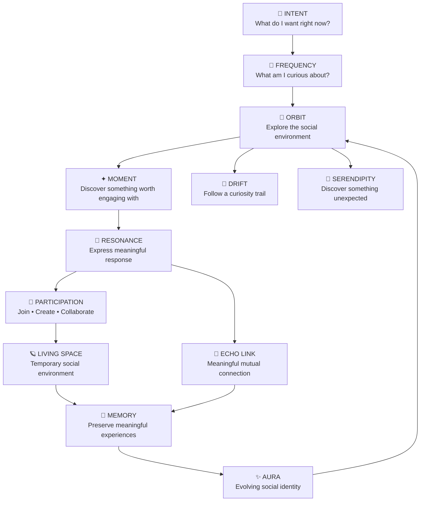
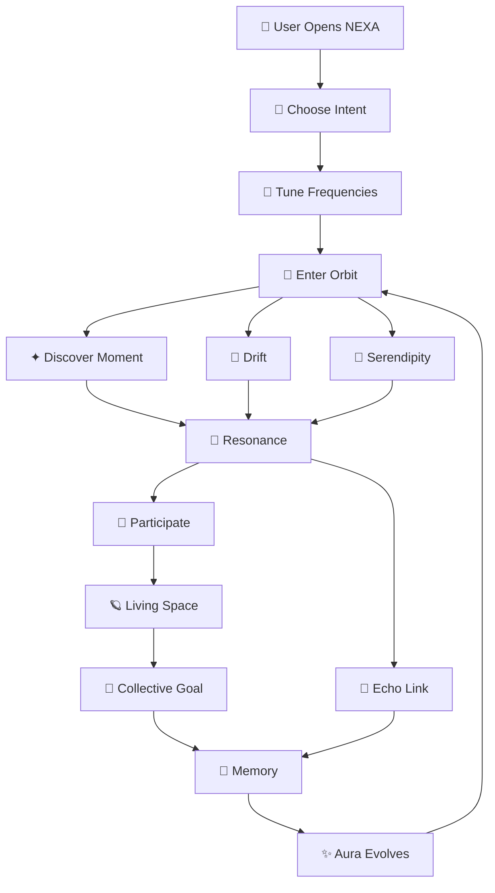
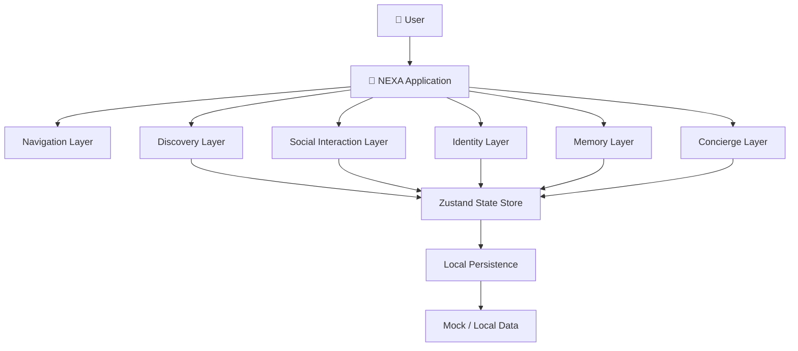
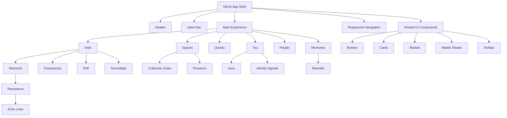

# 🌌 NEXA

## Social Without the Feed.

> **Don't follow people. Follow moments.**

<p align="center">
  <strong>NEXA is an experimental social experience built around intent, curiosity, resonance and meaningful participation — not infinite scrolling.</strong>
</p>

<p align="center">
  <a href="https://nexa-social-arena.vercel.app/">🌐 Live Demo</a>
  &nbsp; • &nbsp;
  <a href="https://github.com/23-shivamsingh/NEXA">💻 Source Code</a>
</p>

---

# 🏆 Hackathon

## The Frontend Odyssey 2026 — Frontend Arena

NEXA is an original frontend-first social experience created for the **REIMAGINE SOCIAL** challenge.

The project explores a fundamental question:

> **What if social media was designed around meaningful experiences instead of maximizing attention?**

NEXA challenges the conventional social-media model of:

- Infinite feeds
- Likes
- Followers
- Popularity metrics
- Algorithmic discovery
- Passive content consumption

and replaces these primitives with a new interaction model based on:

**Intent → Curiosity → Exploration → Resonance → Participation → Connection → Memory**

---

# 📸 Product Preview

<p align="center">
  
</p>

<p align="center">
  <em>NEXA replaces the traditional social feed with a spatial social environment.</em>
</p>

---

# 🚨 The Problem

Modern social platforms are largely built around a familiar loop:

```text
Open App
    ↓
Infinite Feed
    ↓
Scroll
    ↓
Like
    ↓
Follow
    ↓
Scroll Again
    ↓
Repeat
```

This model creates several problems:

- Passive content consumption
- Infinite scrolling
- Popularity-driven discovery
- Follower pressure
- Engagement competition
- Algorithmic filter bubbles
- Social comparison
- Pressure to constantly perform an online identity
- Communities that remain active even after their original purpose disappears

Most importantly, traditional social platforms often optimize for:

> **"How long can we keep you here?"**

NEXA asks a different question:

> **"What meaningful experience can you have here?"**

---

# 💡 Our Solution — NEXA

NEXA reimagines the fundamental primitives of social media.

Instead of opening another infinite feed, users enter a dynamic social environment where they can:

```text
Choose Intent
      ↓
Tune Frequencies
      ↓
Explore Orbit
      ↓
Discover Moments
      ↓
Resonate
      ↓
Participate
      ↓
Connect
      ↓
Create Memories
```

NEXA is not simply a visual redesign of an existing social platform.

It changes the underlying interaction model.

---

# 🧠 The Core Idea

Traditional social platforms:

```text
People
   ↓
Followers
   ↓
Posts
   ↓
Likes
   ↓
Algorithm
   ↓
Feed
   ↓
Scroll
```

NEXA:

```text
Intent
   ↓
Frequencies
   ↓
Orbit
   ↓
Moments
   ↓
Resonance
   ↓
Participation
   ↓
Connection
   ↓
Memory
```

The user is not treated as a passive consumer.

The user becomes an **active participant in a social environment**.

---

# 🔄 Reimagining Social Primitives

| Traditional Social | NEXA |
|---|---|
| 📜 Infinite Feed | 🌌 Orbit |
| 📝 Post | ✦ Moment |
| ❤️ Like | 💫 Resonance |
| 👥 Follow | 📡 Frequency |
| 👤 Followers | 🔗 Echo Links |
| 👥 Groups | 🪐 Living Spaces |
| 📜 Infinite Scroll | 🧭 Drift |
| 🧑 Profile Grid | ✨ Aura |
| 🔥 Trending | 🎲 Serendipity |
| 📊 Popularity | 🤝 Participation |
| 📦 Archive | 🌿 Memory Garden |

This is the foundation of NEXA's social interaction model.

---

# 🌌 NEXA Product Flow



---

# ✨ Key Features

## 01 — 🌌 Orbit

### The Feed → Orbit

Orbit is the primary discovery environment of NEXA.

Instead of displaying content as a vertically stacked feed, Moments exist as spatial nodes around the user.

```text
                    ✦ Moment

        ✦ Moment               ✦ Moment


                       YOU


        ✦ Moment               ✦ Moment

                    ✦ Moment
```

Users can visually explore their surrounding social environment.

Orbit can respond to:

- Current Intent
- Frequencies
- Active Moments
- Social Energy
- Discovery state
- User interactions

### Why Orbit?

The user is no longer endlessly consuming a predetermined content queue.

They are **navigating a social space**.

---

# 02 — 🎯 Intent

NEXA starts with the user's current intention.

Available intents include:

```text
⚡ Create
🧭 Discover
🤝 Connect
🌱 Learn
🎲 Play
🛟 Help
🌊 Just Vibe
```

Instead of an algorithm deciding what the user should see, the user provides the first signal.

```text
"What do I want right now?"
            ↓
          Intent
            ↓
      NEXA adapts
```

Intent influences the discovery experience.

---

# 03 — 📡 Frequencies

### Following People → Following Curiosity

Users don't have to build their social experience around follower lists.

Instead, they tune into **Frequencies**.

Examples:

```text
#GenerativeAudio
#SpatialComputing
#LateNightPhilosophy
#StreetPhotography
#OpenWebProtocols
#AmbientSynthesis
```

Changing Frequencies can influence what appears inside Orbit.

```text
Frequency
    ↓
Orbit recalibration
    ↓
New Moments
    ↓
New People
    ↓
New Spaces
```

The user controls the signal instead of being controlled entirely by an algorithm.

---

# 04 — ✦ Moments

### Posts → Moments

A Moment is more than a traditional social post.

It is a **social invitation**.

Examples:

```text
"Need someone to critique this idea."

"Anyone up for a late-night music recommendation?"

"Let's solve this problem together."

"Looking for people interested in generative audio."

"Help me turn this rough idea into something real."
```

A Moment encourages interaction rather than passive consumption.

```text
Moment
   ↓
Resonance
   ↓
Participation
   ↓
Connection
```

---

# 05 — 💫 Resonance

### Likes → Resonance

NEXA replaces the traditional Like with **Resonance**.

Instead of:

```text
❤️ 2,481 Likes
```

the interaction focuses on how strongly a Moment resonates with the user.

Resonance can use:

- Press & hold
- Radial progress
- Ripple effects
- Pulse animations
- Tactile feedback
- Visual intensity

The goal is:

> **Meaningful response instead of public popularity competition.**

Resonance can also influence later experiences such as Echo Links, Memories and Aura.

---

# 06 — 🔗 Echo Links

### Followers → Echo Links

NEXA does not require one-sided follower relationships.

A meaningful connection can emerge naturally through repeated interaction.

```text
Discover
    ↓
Shared Moment
    ↓
Resonance
    ↓
Repeated Interaction
    ↓
Echo Link
```

An Echo Link represents:

> **"We keep finding something meaningful in each other's presence."**

This makes connection a result of interaction rather than a number displayed on a profile.

---

# 07 — 🧭 Drift

### Infinite Scroll → Curiosity Trail

Drift provides an alternative to endless scrolling.

Traditional social:

```text
Scroll
 ↓
Scroll
 ↓
Scroll
 ↓
Scroll
 ↓
...
```

NEXA Drift:

```text
Moment
   ↓
Unexpected idea
   ↓
Another Moment
   ↓
Person
   ↓
Living Space
   ↓
New curiosity
```

Drift turns discovery into a journey.

The user chooses where curiosity leads.

---

# 08 — 🎲 Serendipity

### Trending → Unexpected Discovery

NEXA intentionally supports discovery outside the user's usual interests.

Instead of another:

> "Trending Now"

experience, NEXA can provide:

> **"Take me somewhere unexpected."**

```text
Normal Orbit
     ↓
Serendipity
     ↓
Unexpected Moment
     ↓
New Interest
     ↓
New Connection
```

The goal is to reduce repetitive discovery loops and encourage curiosity.

---

# 09 — 🪐 Living Spaces

### Groups → Living Spaces

NEXA Spaces are designed as temporary social environments.

A Space can exist around:

- A project
- A conversation
- Music
- Learning
- Creativity
- A challenge
- A shared activity

Examples:

```text
🎧 Anti-Algorithm Radio Lab

🌌 Midnight Stargazing Deck

🧪 Physics Stress-Lab

🎵 3:00 AM Night Train

🎨 Creative Prototype Room
```

The idea is:

> **Don't just join a group. Enter an experience.**

---

# 10 — 🎯 Collective Goals

Living Spaces can contain shared objectives.

Example:

```text
COLLABORATIVE PLAYLIST

████████████████░░░░

17 / 20 contributions
```

Other examples:

```text
Build a concept
3 / 5 contributors

Solve the puzzle
7 / 10 clues

Create a playlist
17 / 20 tracks
```

The focus changes from:

```text
"How many likes did this get?"
```

to:

```text
"What did we create together?"
```

---

# 11 — 🫱 Presence

NEXA supports lower-pressure participation.

Inside a Space, users can communicate their current mode:

```text
💬 Talk
👂 Listen
🎨 Create
👁 Observe
```

Instead of forcing everyone to constantly post or comment, users can simply communicate:

> **"I'm here."**

This allows participation without requiring constant performance.

---

# 12 — 🌿 Memory Garden

Meaningful experiences should not disappear into an infinite feed.

NEXA preserves selected experiences as **Memories**.

A Memory can represent:

- A Moment
- A collaboration
- A Space
- A creative artifact
- A meaningful interaction
- A completed Quest

```text
Live Experience
       ↓
Meaningful Interaction
       ↓
Memory
       ↓
Memory Garden
       ↓
Rekindle
       ↓
New Experience
```

Memories turn social activity into something that can be revisited.

---

# 13 — ✨ Aura

### Profile Grid → Living Identity

Instead of presenting a static grid of posts, NEXA introduces **Aura**.

Aura represents an evolving social identity.

Example dimensions:

```text
✦ Creator
🧭 Explorer
🔗 Connector
⚡ Builder
```

Aura can reflect the user's activity across NEXA:

```text
Exploration
    +
Resonance
    +
Creation
    +
Connection
    +
Participation
        ↓
      AURA
```

The philosophy:

> **Identity is something you develop through experiences, not something you display through follower counts.**

---

# 14 — 🤖 Social Concierge

The Concierge acts as an intelligent social navigator.

Instead of functioning only as a chatbot, it helps users navigate the NEXA ecosystem.

Example requests:

```text
"What can I do right now?"

"I want to meet creative people."

"I'm bored but don't want to scroll."

"I want to build something with someone."

"Show me something completely unexpected."
```

The Concierge can guide users toward:

```text
Intent
  ↓
Frequencies
  ↓
Moments
  ↓
Spaces
  ↓
People
```

---

# 15 — 🏆 Social Quests

Quests turn discovery into active participation.

Examples:

```text
Meet someone who knows something you don't.

Explore a Space outside your usual interests.

Ask a thoughtful question.

Create something with someone new.

Discover a new Frequency.

Remix an existing Moment.
```

The goal is to make social discovery feel like an experience rather than consumption.

---

# 16 — 🔀 Remix

NEXA treats ideas as things that can evolve.

A Moment can transform into:

```text
Thought
  ↓
Question
  ↓
Challenge
  ↓
Collaboration
  ↓
Artifact
```

Remix allows users to build upon existing ideas instead of simply reacting to them.

---

# 17 — 👻 Ghost Mode

Ghost Mode provides a lower-pressure exploration experience.

Users can explore selected parts of NEXA without turning every action into a permanent social signal.

This supports:

- Exploration
- Experimentation
- Curiosity
- Low-pressure participation

---

# 18 — 🧠 Moment Lifecycle

NEXA can treat Moments as living experiences instead of permanent posts.

```text
Moment Created
      ↓
Discovery
      ↓
Resonance
      ↓
Participation
      ↓
Meaningful Interaction
      ↓
┌───────────────┐
│               │
▼               ▼
Fades         Anchors
│               │
▼               ▼
Expires       Memory
                │
                ▼
          Memory Garden
```

A Moment can gain longer-term relevance through meaningful interaction instead of raw popularity.

---

# 19 — ⚡ Social Energy

Users can communicate their current social state.

Examples:

```text
🌙 Quiet
🧭 Curious
🤝 Social
🎨 Creative
⚡ Chaotic
```

This is not a permanent personality label.

It represents:

> **"What kind of social experience do I want right now?"**

Social Energy can influence discovery and recommendations.

---

# 🔗 How Features Work Together

NEXA's features are intentionally interconnected.

```text
Intent
   ↓
Frequency
   ↓
Orbit
   ↓
Moment
   ↓
Resonance
   ↓
Participation
   ↓
Echo Link
   ↓
Memory
   ↓
Aura
   ↓
Back to Orbit
```

Additional paths:

```text
Orbit
  ↓
Drift
  ↓
New Moment
  ↓
Resonance
```

```text
Orbit
  ↓
Living Space
  ↓
Collective Goal
  ↓
Collaboration
  ↓
Memory
```

```text
Concierge
  ↓
Intent
  ↓
Frequency
  ↓
Moment / Space / Person
```

This makes NEXA feel like a **social system**, rather than a collection of unrelated pages.

---

# 🔄 Complete User Journey



---

# 🏗️ System Architecture



---

# 🧩 Frontend Architecture



---

# 🛠️ Technology Stack

| Layer | Technology |
|---|---|
| Frontend | React + TypeScript |
| Build Tool | Vite |
| Styling | Tailwind CSS |
| State Management | Zustand |
| Animation | Motion / Framer Motion |
| Icons | Lucide React |
| Visual System | SVG + CSS |
| Data | Mock / Local Data |
| Persistence | Browser Local Storage |
| AI | Gemini / AI-assisted features where configured |
| Version Control | Git + GitHub |

---

# 🎨 Design System

NEXA uses a distinctive spatial visual language.

### Visual Principles

- Cosmic / spatial aesthetic
- Deep dark surfaces
- Electric cyan accents
- Violet interaction states
- High-contrast typography
- Subtle gradients
- Thin borders
- Spatial layouts
- Purposeful motion
- Strong visual hierarchy

### Design Goal

NEXA should feel:

> **Futuristic. Calm. Spatial. Tactile. Human.**

The interface is designed to avoid the appearance of a generic AI-generated dashboard.

---

# 🎞️ Motion & Interaction

Motion is used to communicate state rather than simply decorate the interface.

Examples:

```text
Intent Change
     ↓
Orbit Recalibrates
```

```text
Hover
     ↓
Interactive Feedback
```

```text
Resonance
     ↓
Pulse / Ripple
```

```text
Echo Link
     ↓
Connection Animation
```

```text
Quest Completion
     ↓
Progress Transformation
```

```text
Memory Rekindle
     ↓
Experience Transition
```

Interactive controls provide clear states:

```text
IDLE
  ↓
HOVER
  ↓
ACTIVE
  ↓
SELECTED
```

Touch devices use tap and press interactions rather than depending exclusively on hover.

---

# 📱 Responsive Design

NEXA is designed as a responsive product from the ground up.

## Desktop

- Spatial Orbit
- Full navigation
- Expanded layouts
- Side panels
- Rich interactions

## Tablet

- Adaptive density
- Responsive grids
- Touch-friendly controls
- Contextual panels

## Mobile

- Hamburger navigation
- Mobile drawer
- Bottom navigation
- One-column layouts
- Touch-friendly controls
- Mobile sheets
- Simplified Orbit
- Responsive cards

Target viewport ranges:

```text
320px
360px
375px
390px
414px
430px
480px
600px
768px
834px
1024px
1280px
1440px
1600px
1920px+
```

---

# 🌓 Theme Support

NEXA supports:

```text
☀️ Light Mode
🌙 Dark Mode
```

The design system ensures that:

- Text remains readable
- Cards maintain contrast
- Interactive elements remain visible
- Borders remain distinguishable
- Hover states work in both themes
- Controls remain accessible

---

# ♿ Accessibility

Accessibility is considered throughout the interface.

NEXA includes considerations for:

- Semantic HTML
- Keyboard navigation
- Visible focus states
- Accessible controls
- Readable contrast
- Touch-friendly targets
- Responsive dialogs
- Escape-to-close interactions
- Reduced-motion preferences
- Mobile usability

---

# 🧠 State & Data Model

NEXA uses centralized state to connect the different social experiences.

Conceptually:

```text
                    NEXA STATE
                        │
        ┌───────────────┼────────────────┐
        │               │                │
        ▼               ▼                ▼
      USER           DISCOVERY         SOCIAL
        │               │                │
        │          ┌────┼────┐       ┌───┴────┐
        │          ▼    ▼    ▼       ▼        ▼
        │       Intent Freq Orbit Resonance Echo
        │
        ├───────────────┐
        ▼               ▼
      AURA           MEMORY
        │               │
        └───────┬───────┘
                ▼
              ORBIT
```

The state system enables interactions to influence other parts of the experience.

For example:

```text
Resonance
    ↓
Echo Link
    ↓
Memory
    ↓
Aura
```

---

# 📁 Project Structure

```text
NEXA/
│
├── public/
│   ├── favicon.svg
│   └── ...
│
├── src/
│   ├── components/
│   │   ├── navigation/
│   │   ├── orbit/
│   │   ├── moments/
│   │   ├── spaces/
│   │   ├── quests/
│   │   ├── memories/
│   │   ├── people/
│   │   ├── identity/
│   │   └── shared/
│   │
│   ├── data/
│   ├── hooks/
│   ├── store/
│   ├── utils/
│   └── ...
│
├── public/
│
├── index.html
├── package.json
├── server.ts
├── tsconfig.json
├── vite.config.ts
├── bun.lock
└── README.md
```

> The exact implementation structure may evolve as the project develops.

---

# 🚀 Getting Started

## Prerequisites

Make sure you have:

- Node.js
- npm
- Git

---

## 1. Clone the Repository

```bash
git clone YOUR_GITHUB_REPOSITORY_URL
```

```bash
cd NEXA
```

---

## 2. Install Dependencies

```bash
npm install
```

---

## 3. Start Development Server

```bash
npm run dev
```

Open the local URL provided by Vite.

Usually:

```text
http://localhost:5173
```

---

## 4. Production Build

```bash
npm run build
```

---

## 5. Preview Production Build

```bash
npm run preview
```

---

# 🔐 Environment Variables

If AI/API functionality is configured, create the required local environment file.

Example:

```env
GEMINI_API_KEY=your_api_key
```

Never commit real API keys or secrets to GitHub.

Recommended `.gitignore`:

```gitignore
node_modules/
dist/
.env
.env.local
.env.*.local
```

---

# 🧪 Judge Demo Flow

A short demo can communicate the complete NEXA idea quickly.

## Step 1 — Open NEXA

Start at the NEXA Orbit.

Show:

> **NO-FEED**

Explain that NEXA is not another infinite-scroll platform.

---

## Step 2 — Choose Intent

Select:

```text
🧭 Discover
```

Explain:

> "Instead of starting with a feed, NEXA starts by asking what I want right now."

---

## Step 3 — Tune a Frequency

Select a curiosity such as:

```text
#SpatialComputing
```

Show Orbit responding to the user's interest.

---

## Step 4 — Open a Moment

Select a Moment from Orbit.

Explain:

> "A Moment isn't just content. It's an invitation to participate."

---

## Step 5 — Demonstrate Resonance

Use the Resonance interaction.

Show the visual response.

Explain:

> "Instead of a public like count, NEXA uses Resonance as a meaningful response."

---

## Step 6 — Enter a Living Space

Join a Space.

Show:

- Participants
- Presence
- Collective Goal
- Collaboration

---

## Step 7 — Show Echo Link

Demonstrate meaningful interaction leading toward an Echo Link.

---

## Step 8 — Show Memories

Open the Memory experience.

Explain:

> "Meaningful experiences don't disappear into an infinite feed."

---

## Step 9 — Show Aura

Open:

```text
You → Aura
```

Explain:

> "Instead of a static profile grid, NEXA represents identity as something that evolves through experiences."

---

# 🎤 30-Second Pitch

> **"Most social platforms start with a feed. NEXA starts with you.**
>
> You choose your intent, tune into your interests, and explore a spatial Orbit of Moments instead of endlessly scrolling.
>
> Likes become Resonance. Followers become Echo Links. Groups become Living Spaces. And your profile becomes an evolving Aura.
>
> The goal isn't to keep you scrolling longer.
>
> **It's to help you discover something meaningful, participate in it, connect with people, and remember the experience."**

---

# 🏆 Hackathon Evaluation Alignment

NEXA is designed around the major evaluation dimensions of a frontend innovation challenge.

---

## 🎯 Problem Understanding

NEXA directly addresses limitations of conventional feed-based social platforms:

- Infinite consumption
- Algorithmic discovery
- Popularity pressure
- Follower-centric relationships
- Passive engagement
- Filter bubbles

Rather than adding another feature to the existing model, NEXA changes the model itself.

---

## 💡 Creativity & Innovation

NEXA introduces a new social vocabulary:

```text
Feed       → Orbit
Post       → Moment
Like       → Resonance
Follow     → Frequency
Followers  → Echo Links
Groups     → Living Spaces
Scroll     → Drift
Profile    → Aura
Trending   → Serendipity
Archive    → Memory
```

These are not isolated UI changes.

They form one connected interaction system.

---

## 🎨 Visual Design

NEXA uses a distinctive visual language based on:

- Spatial discovery
- Orbiting nodes
- Dynamic Moments
- Animated Resonance
- Living Aura
- Cosmic visual language
- Light / dark themes
- Responsive layouts
- Micro-interactions

The visual design is intended to reinforce the product concept rather than simply decorate it.

---

## 🧭 User Experience

The primary mental model is:

```text
What do I want?
      ↓
Intent

What am I curious about?
      ↓
Frequency

What's happening around me?
      ↓
Orbit

What resonates?
      ↓
Moment

What can I participate in?
      ↓
Living Space

Who did I meaningfully connect with?
      ↓
Echo Link

What remains?
      ↓
Memory
```

---

## ⚙️ Functionality

NEXA brings multiple interactions into one connected experience:

- Orbit discovery
- Grid discovery
- Intent selection
- Frequency tuning
- Moment exploration
- Resonance interaction
- Echo Links
- Drift Mode
- Serendipity
- Living Spaces
- Collective Goals
- Presence states
- Social Quests
- Memories
- Aura
- People discovery
- Concierge
- Remix
- Notifications
- Search
- Ghost Mode
- Theme switching
- Responsive navigation

---

## 📱 Responsiveness

NEXA is designed for:

```text
Desktop
Tablet
Mobile
```

with interaction patterns adapted to each form factor.

---

## 🧹 Code Quality

The implementation focuses on:

- TypeScript
- Reusable components
- Centralized state
- Modular UI
- Responsive utility classes
- Maintainable interactions
- Reusable visual primitives
- Separation of UI and state
- Local persistence where appropriate

---

# 📊 Traditional Social vs NEXA

## Traditional Social

```text
POST
  ↓
LIKE
  ↓
FOLLOW
  ↓
ALGORITHM
  ↓
FEED
  ↓
SCROLL
  ↓
REPEAT
```

## NEXA

```text
INTENT
  ↓
CURIOSITY
  ↓
EXPLORE
  ↓
RESONATE
  ↓
PARTICIPATE
  ↓
CONNECT
  ↓
CREATE
  ↓
REMEMBER
```

The difference is not only visual.

> **NEXA changes what the user is actually doing.**

---

# 🌟 What Makes NEXA Different?

NEXA is intentionally not:

```text
Another Instagram
Another Reddit
Another X
Another Snapchat
Another TikTok
```

Instead, NEXA asks:

> **Can we redesign the fundamental interaction model of social media?**

The answer is expressed through:

```text
Feed
 ↓
Orbit

Post
 ↓
Moment

Like
 ↓
Resonance

Follow
 ↓
Frequency

Follower
 ↓
Echo Link

Group
 ↓
Living Space

Scroll
 ↓
Drift

Profile
 ↓
Aura

Trending
 ↓
Serendipity

Archive
 ↓
Memory
```

This makes NEXA a **new social interaction model**, rather than another social-media clone.

---

# 🗺️ NEXA Architecture at a Glance

```text
                         🌌 NEXA
                           │
                           ▼
                     ┌───────────┐
                     │  INTENT   │
                     └─────┬─────┘
                           │
                           ▼
                   ┌───────────────┐
                   │  FREQUENCIES  │
                   └───────┬───────┘
                           │
                           ▼
                   ┌───────────────┐
                   │     ORBIT     │
                   └───────┬───────┘
                           │
              ┌────────────┼────────────┐
              ▼            ▼            ▼
          MOMENTS        DRIFT      SERENDIPITY
              │
              ▼
        ┌────────────┐
        │ RESONANCE  │
        └─────┬──────┘
              │
        ┌─────┴─────┐
        ▼           ▼
 PARTICIPATION   ECHO LINK
        │           │
        ▼           │
 LIVING SPACE       │
        │           │
        ▼           │
 COLLECTIVE GOAL    │
        │           │
        └─────┬─────┘
              ▼
        MEMORY GARDEN
              │
              ▼
             AURA
              │
              └──────────────► ORBIT
```

---

# 🔮 Future Roadmap

## Phase 1 — Current Hackathon Prototype

```text
Orbit
Moments
Intent
Frequencies
Resonance
Echo Links
Living Spaces
Quests
Memories
Aura
People
Concierge
Remix
```

---

## Phase 2 — Realtime Social

Potential future capabilities:

- Realtime Spaces
- Live Presence
- Collaborative Canvas
- Shared Audio
- Realtime Collective Goals
- Live Resonance
- Realtime notifications

---

## Phase 3 — Intelligent Discovery

Potential future capabilities:

- Semantic Moment matching
- Context-aware discovery
- Adaptive Frequencies
- Intelligent Concierge
- Better serendipity
- Curiosity-based recommendations

---

## Phase 4 — IRL Orbit

NEXA can eventually move beyond the screen.

```text
Online Moment
      ↓
Living Space
      ↓
IRL Orbit
      ↓
Real-world Experience
      ↓
Memory
```

Potential applications:

- Local activities
- Meetups
- Events
- Collaborative sessions
- Interest-based gatherings

---

# 🌍 Long-Term Vision

NEXA imagines a future where social technology is not primarily designed around:

```text
Attention
Popularity
Followers
Virality
```

but around:

```text
Curiosity
Participation
Connection
Creation
Memory
```

The fundamental shift is:

```text
FROM

"Who should I follow?"

TO

"What do I want to experience?"
```

---

# 🧭 Design Principles

### 01 — Intent Over Algorithm

The user provides the first signal.

### 02 — Participation Over Consumption

Social experiences should lead somewhere.

### 03 — Resonance Over Popularity

Meaning matters more than public numbers.

### 04 — Curiosity Over Filter Bubbles

Discovery should sometimes surprise us.

### 05 — Experience Over Profile

People are more than their profile grids.

### 06 — Connection Over Followers

Relationships should emerge naturally.

### 07 — Memory Over Metrics

Meaningful experiences are worth preserving.

---

# 📸 Screenshots

## 🌌 Orbit

<p align="center">
  
</p>

> The traditional feed becomes a spatial Orbit where Moments appear as discoverable social nodes.

---

## 🪐 Living Spaces

<p align="center">
  
</p>

> Enter temporary social environments built around collaboration, creativity, learning and shared experiences.

---

## 🏆 Quests

<p align="center">
  
</p>

> Quests turn passive browsing into active social participation.

---

## 🌿 Memories

<p align="center">
  
</p>

> Meaningful Moments and interactions can become Memories instead of disappearing into an endless feed.

---

## 🤖 Social Concierge

<p align="center">
  
</p>

> Concierge acts as an intelligent social navigator, helping users discover Moments, Spaces, Frequencies and people.

---

---

# 🧪 Project Status

**Status: Hackathon Prototype**

NEXA is a frontend-focused prototype created to demonstrate a new social interaction model.

The prototype uses mock/local data where appropriate so that the complete experience can be demonstrated reliably during judging.

The architecture is designed so that realtime services, persistent databases and production AI capabilities can be integrated in future iterations.

---

# 📦 Demo Checklist

Before presenting NEXA, verify:

```text
☑ Orbit works
☑ Intent selection works
☑ Frequency selection works
☑ Moments open correctly
☑ Resonance interaction works
☑ Echo interactions work
☑ Living Spaces open
☑ Collective Goals update
☑ Quests work
☑ Memories open
☑ Aura displays correctly
☑ Concierge works
☑ Search works
☑ Notifications work
☑ Theme switching works
☑ Mobile navigation works
☑ Responsive layouts work
☑ Hover states work
☑ Buttons have feedback
☑ Forms work
☑ Local state persists where intended
☑ No broken routes
☑ No console errors
☑ No horizontal overflow
☑ Favicon loads correctly
```

---

# 👨‍💻 Team

## Built Solo

### Shivam Singh

**Role:** Product Concept • UX/UI Design • Frontend Development • Interaction Design • Testing

NEXA was designed, developed and presented as an **individual solo hackathon project**.

```text
Idea
 ↓
Product Concept
 ↓
Social Interaction Model
 ↓
UX / UI Design
 ↓
Frontend Development
 ↓
Interaction Engineering
 ↓
Responsive Design
 ↓
Testing & Refinement
 ↓
Final Submission
```

> **One builder. One vision. One new way to think about social.**

---

# ❤️ Final Thought

Most social platforms ask:

> **"What should we show you next?"**

NEXA asks:

> **"What do you want to experience right now?"**

---

# 🌌 NEXA

## **Social Without the Feed.**

> **Don't follow people. Follow moments.**

<p align="center">
  <strong>Built solo by Shivam Singh for The Frontend Odyssey 2026 — Frontend Arena.</strong>
</p>

<p align="center">
  <em>Intent → Curiosity → Resonance → Participation → Connection → Memory</em>
</p>